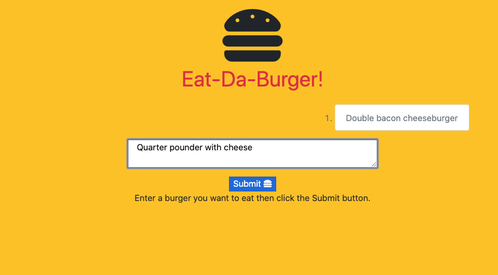

# Eat-Da-Burger
[](http://unlicense.org/)

## Description

a restaurant app that lets users input the names of burgers they'd like to eat

## Table of Contents

* [Installation](#installation)

* [Usage](#usage)

* [License](#license)

* [Contributing](#contributing)

* [Tests](#tests)

* [Screenshot](#screenshot)

* [Links](#links)

* [Questions](#questions)

## Installation

To install the necessary dependencies, run the following command:

```
npm install
```

Then run the schema.sql commands into your MySQL database. Modify the connection.js to point to your database.

## Usage

Run the `node server.js` command to start the server.
Enter the name of a burger you would like to eat and click the submit button. This will add the burger to the list of burgers to eat. Click the Devour button next to the burger you want to eat, and it will be placed int the devoured burger list.

## License

This project is licensed under the None license.

## Contributing

Send me a pull request.

## Tests

To run tests, please run the following command:

```
N/A
```

## Screenshot



## Links

(GitHub Repository)[https://github.com/zackapotamus/Eat-Da-Burger]

(Heroku Hosted Page)[https://evening-wildwood-51374.herokuapp.com/]

## Questions


If you have any questions about the repo, open an issue or contact [zackapotamus](https://api.github.com/users/zackapotamus) at (zack.hayden@gmail.com)[mailto:zack.hayden@gmail.com]).

